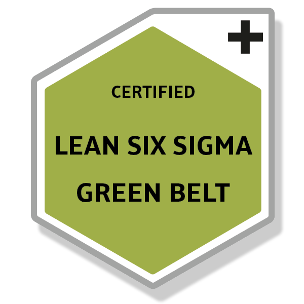
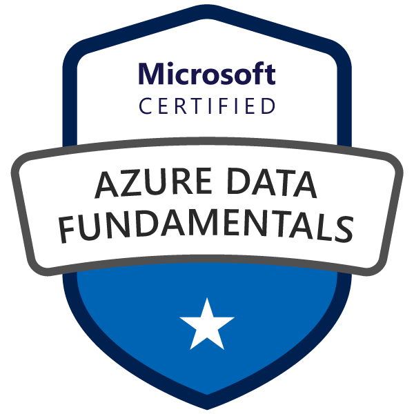
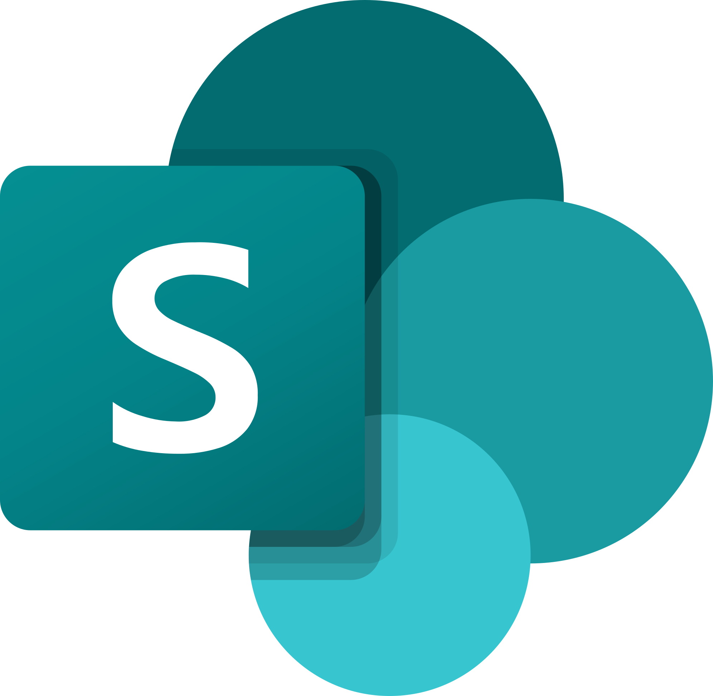

<!--- link of the hand gif --->
## Hi there 
I'm a self-taught Data Analyst and Business Intelligence Consultant from Brazil, but currently living in Portugal. I help others with data analysis projects and developing more skills in data engineering with end-to-end real-life projects. If you are interested in knowing more about me, **[check my Resumé!](./files/CV%20Standard%20-%20Eduardo%20Cysne%20(EN).pdf)** 📄

### My Certificates 🎖️
All the certificates I've achieved in my career, in reverse chronological order (newest to oldest)!

  
  &nbsp;
  
  &nbsp;
  
  &nbsp;
  
  &nbsp;
  

### Tech Stack 🛠️

These are the main tools I use to do my job, all of which I have hands-on experience with.

  
  &nbsp;&nbsp;
  
  &nbsp;&nbsp;
  
  &nbsp;&nbsp;
  
  &nbsp;&nbsp;
  
  &nbsp;&nbsp;
  
  &nbsp;&nbsp;
  
  &nbsp;&nbsp;
  
  &nbsp;&nbsp;
  
  &nbsp;&nbsp;
  
  &nbsp;&nbsp;
  
  &nbsp;&nbsp;
  

### Beyond Data 👨🏻

When I'm not working with data, you'll probably find me...
- 🤼‍♂️ **On a mat:** I'm a Blue Belt who loves grappling and jiu-jitsu!
- ⛰️ **In nature:** I love trekking to clear and relax my mind.
- 🏖️ **At the beach:** I was born at the beach, so I'm usually there too!
- 📍 **Somewhere around the world:** Knowing different cultures and people is what makes me wanna learn, study and work more!
- 🏋🏻‍♂️ **Exercising my body:** Swimming, lifting weights, running - anything!
- 📖 **Reading a good book:** My Netflix.

